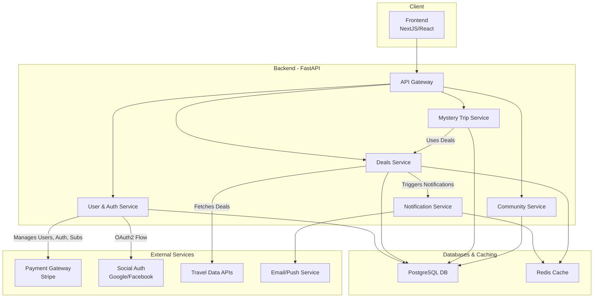
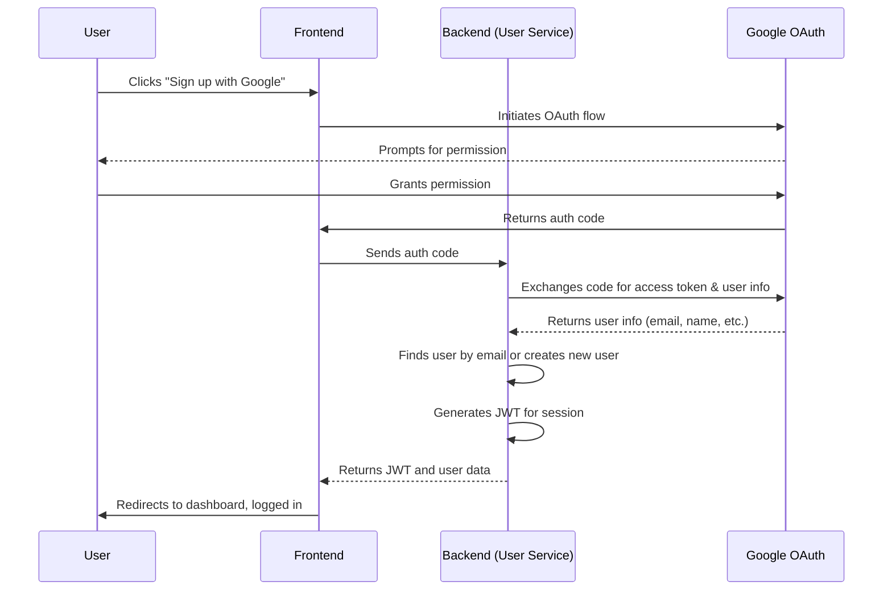
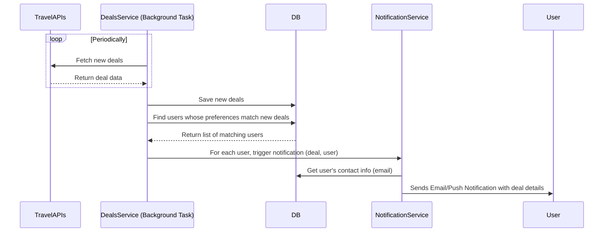
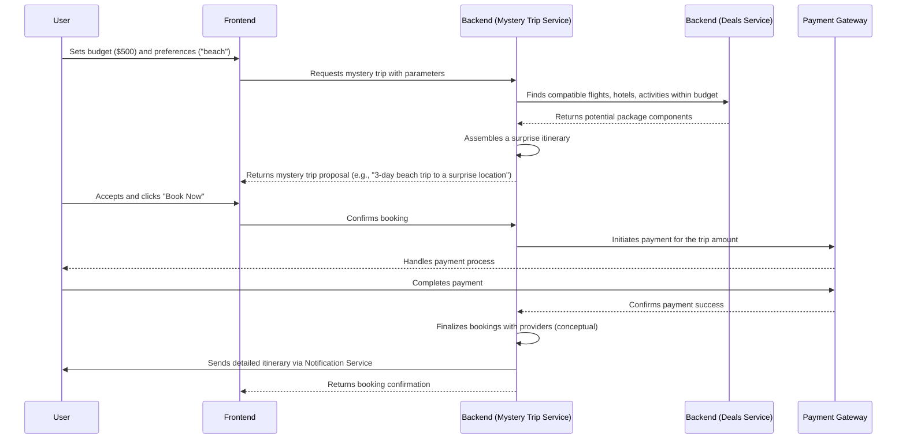

# Technical Design Document

This document outlines the technical architecture, key user flows, and implementation details for the Viagem Econômica platform, based on the user stories in `specs/FEATURES.md`.

## 1. High-Level Architecture

The system will be built using a service-oriented architecture, with a Python/FastAPI backend and a modern Single Page Application (SPA) frontend. This approach allows for modularity and scalability.

### Components

* **SPA Frontend:** A responsive web application built with a framework like React or Vue.js. It will communicate with the backend via a RESTful API.
* **Backend (FastAPI):**
  * **API Gateway:** The main entry point for all client requests. Handles request validation and routing to internal services.
  * **User Service:** Manages user identity, authentication (JWT-based), social login (OAuth2), profiles, preferences, and subscriptions.
  * **Deals Service:** Ingests, stores, and manages travel deals from third-party APIs. It will have a mechanism (e.g., scheduled background tasks) to keep deals fresh.
  * **Mystery Trip Service:** Contains the logic for generating and packaging "mystery trips" based on user inputs.
  * **Community Service:** Powers social features like forums, member profiles, and connections.
  * **Notification Service:** Handles sending emails and push notifications for deal alerts, social interactions, etc.
* **Database (PostgreSQL):** The primary data store for all services. A relational model is suitable for the structured data (users, deals, posts).
* **Cache (Redis):** Used for caching frequently accessed data like deal feeds, user sessions, and as a message broker for background tasks.
* **External Services:**
  * **Payment Gateway (Stripe):** For secure handling of subscription payments.
  * **Social Auth Providers:** For "one-click" sign-up and login.
  * **Travel Data APIs:** For sourcing flights, hotels, and activities.
  * **Email/Push Service (SendGrid/FCM):** For reliable delivery of notifications.

## 2. Sequence Diagrams

### 2.1. User Signup (Social Login)

*As a Prospective Member, I want to sign up in one click using my social media account.*

### 2.2. Last-Minute Deal Notification

*As a General Member, I want to set up email or push notifications for deals that match my specific criteria.*

### 2.3. Booking a "Mystery Trip"

*As an Adventurous Explorer, I want to use a tool where I can set a budget and general preferences to generate a surprise trip.*

## 3. Implementation Considerations

### Technology Stack

* **Backend:** Python 3.12+, FastAPI
* **Database:** PostgreSQL
* **Cache/Broker:** Redis
* **Frontend:** NextJS / React
* **Containerization:** Docker, Docker Compose
* **CI/CD:** GitHub Actions

### Authentication

* **Session Management:** Use JWT (JSON Web Tokens) passed in the `Authorization` header. The tokens will be short-lived.
* **Social Login:** Implement OAuth2 flows for Google and Facebook using a library like `Authlib`. Securely store refresh tokens.

### Data Modeling (Initial Thoughts)

* **`users`**: id, email, password_hash, name, data (JSONB, with the rest of profile info), created_at
* **`subscriptions`**: id, user_id, plan_type (free, premium), status, stripe_subscription_id, start_date, end_date, data (JSONB)
* **`user_preferences`**: user_id, data (JSONB, with notification_prefs, travel_prefs: budget, interests)
* **`deals`**: id, title, description, price, destination, start_date, end_date, source_api, deal_type (flight, hotel), data (JSONB)
* **`mystery_trips`**: id, user_id, budget, status (booked, completed), data (JSONB, with preferences, generated_itinerary)
* **`forum_posts`**: id, user_id, title, content, parent_post_id (for replies), data (JSONB), created_at

### Background Tasks

Heavy operations like fetching deals from external APIs, sending bulk notifications, and processing data should be handled asynchronously to avoid blocking the API server.

* FastAPI's built-in `BackgroundTasks` will be used for background tasks (e.g., sending a single confirmation email).

### The "Mystery Trip" Algorithm

This is a key feature and a creative challenge. A possible approach:

1. Query the `Deals` table based on the user's high-level preferences (e.g., `type='beach'`).
2. Filter results that fall significantly below the user's budget to ensure a complete package can be built.
3. Use a constraint satisfaction or optimization algorithm to combine a flight deal + hotel deal + activity deal that:

* Fits within the total budget.
* Has compatible dates and locations.
* Maximizes a "quality" score (e.g., hotel rating, flight convenience).

Have fallback options and clear error handling for when no suitable package can be generated.

### Security

* Use FastAPI's Pydantic integration for automatic request data validation.
* Implement rate limiting to protect against brute-force attacks on login endpoints.
* Store passwords using a strong hashing algorithm (e.g., Argon2, bcrypt).
* Sanitize all user-generated content (forum posts, profiles) to prevent XSS attacks.
* Use parameterized queries to prevent SQL injection.
